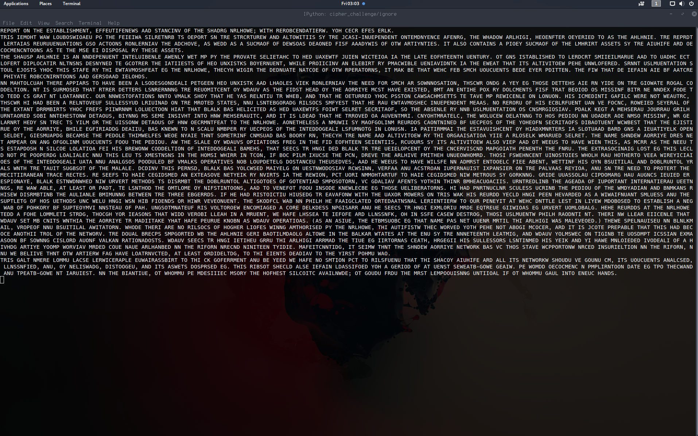

---
title:	National Cipher Challenge round 10 challenge B write-up
author: Lost In Translation
output: pdf_document
---

# Initial Analysis
## Frequency Analysis
First we looked at the distribution of letters in the cipher text using freq_analyser.py:

##### freq_analyser.py
```{python eval=FALSE}
#!/usr/bin/python3
from itertools import repeat
from string import ascii_uppercase
from argparse import ArgumentParser
import matplotlib.pyplot as plt
import numpy as np
from os import getcwd

CWD = getcwd() + "/"

parser = ArgumentParser(description="Analyse the frequency of letters in a text file.")
parser.add_argument("file", help="the file containing the text to analyse")

file = parser.parse_args().file
freq = dict(zip(ascii_uppercase, repeat(0)))

data = filter(lambda x: x<128, open(file, "rb").read())
letters = "".join(filter(lambda c:c.isalpha(), map(chr, data))).upper()
for i in letters:
	freq[i]+=1

text_length = len(letters)

percents = {i:j/text_length for i, j in freq.items()}
english_distribution = {i:float(j) for i,j in map(lambda x: x.split(','), 
	open(CWD + "../resources/english_letter_freqs").read().split())}

# regenerate the english letter frequencies used as a comparison to the ciphertext
# open(CWD+"../resources/english_letter_freqs","w").write("\n".join("{},{}".format(*i)
#	for i in percents.items()))

fig, ax = plt.subplots()
index = np.arange(len(ascii_uppercase))
bar_width = 0.35
opacity = 0.8
r1 = plt.bar(index, 
			english_distribution.values(), 
			bar_width, alpha=opacity, 
			color='b', 
			label='english')
r1 = plt.bar(index+bar_width, 
			percents.values(), 
			bar_width, 
			alpha=opacity, 
			color='r', 
			label='ciphertext')
plt.xlabel('letter')
plt.ylabel('frequency')
plt.title('Frequency Analysis')
plt.xticks(index+bar_width, list(ascii_uppercase))
plt.legend()

plt.savefig(CWD + "../freq_out.png")
plt.show()
```

<center>

</center>

Above is the output of freq_analyser.py when run against the ciphertext. From this we can infer that the cipher is polyalphabetic due to the approximately even distribution of letters in the text.

***

## Key Length Analysis
Having determined that it was a polyalphabetic cipher we attempted to find the key length using the Index Of Coincidence(IOC) of sequences of letters, i.e. every third letter, we then take the average IOC over those sequences and when the average IOC suddenly jumps we have found the key length. This is implemented by guess-keylen.py.

##### guess-keylen.py

```{python eval=FALSE}
#!/usr/bin/python3
from os import getcwd
import sys
sys.path.append(getcwd()+"/../modules/")

from argparse import ArgumentParser
from string import ascii_uppercase
from score import ioc
from functools import reduce
from itertools import takewhile
from math import gcd

parser = ArgumentParser()
parser.add_argument("file", type=str, help="the file to analyse")
file = parser.parse_args().file

data = filter(lambda x: x<128, open(file, "rb").read())
letters = "".join("".join(filter(lambda x:  x.upper() in ascii_uppercase, 
                                            map(chr, data))).split())

scores = [sum(ioc("".join(letters[j::i])) for j in range(i))/i for i in range(1, 200)]
sorted_scores = sorted(scores, reverse=True)

def diff(x):
    i = sorted_scores.index(x)
    return abs(sorted_scores[i] - sorted_scores[i+1])

scores_of_multiples = takewhile(lambda x: diff(x)<0.1, sorted_scores)
indicies_of_multiples = map(lambda x: scores.index(x)+1, scores_of_multiples) 
# +1 to offset the array notation and get actual key length

keylen = reduce(gcd, indicies_of_multiples)

if keylen == 1: 
	# probably failed to guess the key length so default and 
    # print the list of scores for each keylen
    print("Failed to find key length, try to look for high values of IOC that have key \
lengths that are multiples of each other in the below table.")
    print()
    print("Key Length : Index Of Coincidence")
    for i, j in enumerate(scores[:50]):
        print("{:<2}:{:.6f}".format(i+1, j))
else:
    print("found key length of {}".format(keylen))
```
This gives us a key of probably length 7. Running freq_analyser.py against those sequences obtains a frequency graph closely matching an english substitution.

<center>

</center>

# Cracking the Cipher
## Consolidating Information
* It is probably a polyalphabetic substitution cipher
* The key is probably length 7 

***

## Approach
1. Break the ciphertext down into the parts that will be enciphered by each monoalphabetic cipher that is in rotation.
2. Run basic frequency analysis against each block to get a starting letter mapping.
3. Decipher the ciphertest with the mappings and display the result
4. Continue running 3 at a constant time interval and swap letters in the mappings by looking at the deciphered text and attempting the match cipher text words to english words.
5. Repeat until the ciphertext contains no spelling errors and everything is in english.

## Implementation
1. Step 1 is implemented by splitter.py:

##### splitter.py

```{python eval=FALSE}
#!/usr/bin/python3.7
from string import ascii_uppercase
from os import mkdir
from os.path import isdir

if not isdir("./spam/"): mkdir("./spam/")

data = filter(lambda x: x<128, open("../challenges/10b.txt", "rb").read())
letters = "".join("".join(filter(lambda x: x.upper() in ascii_uppercase, 
                                 map(chr, data))).split())

for i in range(7):
    open("./spam/{}".format(i), "w").write("".join(letters[i::7]))
```

***

2. Step 2 is implemented by gen_maps.py: 

##### gen_maps.py

```{python eval=FALSE}
#!/usr/bin/python3.7
from itertools import repeat
from string import ascii_uppercase
from json import dumps

def analyse_freq(text):
    freq = dict(zip(ascii_uppercase, repeat(0)))
    most_common = ['E', 'T', 'A', 'O', 'I', 'N', 'S', 'R', 'H', 'D', 'L', 'U', 
    'C', 'M', 'F', 'W', 'G', 'Y', 'P', 'B', 'V', 'K', 'X', 'J', 'Q', 'Z']
    for i in text:
        freq[i]+=1
    s = sorted(freq, key=(lambda x: freq[x]), reverse=True)
    return dict(zip(s, most_common))

texts = [open("spam/{}".format(i)).read() for i in range(7)]

for i, mapping in enumerate(map(analyse_freq, texts)):
    open("mappings/{}".format(i), "w").write(dumps(mapping))
```

***

3. Step 3 is implemented by solve10.py. solve10.py also writes the deciphered text interlaced with the num of the monoalphabetic substitution it was enciphered with to a file called helpful which is useful later for swapping around characters in the mappings.

##### solve10.py

```{python eval=FALSE}
#!/usr/bin/python3.7
from os import getcwd
import sys
sys.path.append(getcwd()+"../modules/")

from string import ascii_uppercase
from itertools import zip_longest, cycle
from json import loads
data = filter(lambda x: x<128, open("../challenges/10b.txt", "rb").read())
text = "".join(map(chr, data))
letters = "".join("".join(filter(lambda x: x.upper() in ascii_uppercase, text)).split())

mono_alphabet_ciphers = ["".join(letters[j] for j in range(i, len(letters), 7)) 
                        for i in range(7)]

mappings = [loads(open("mappings/{}".format(i)).read()) for i in range(7)]

mapped = ["".join(map(lambda x: mappings[i][x], 
                                mono_alphabet_ciphers[i])) 
                                for i in range(7)]

def print_subbed(subbed_arr):
    deciphered_letters = "".join(map(lambda x: "".join(x), 
                                     zip_longest(*subbed_arr, fillvalue="z")))
    pos = 0
    for i in text:
        if i in ascii_uppercase:
            sys.stdout.write(deciphered_letters[pos])
            pos += 1
        else:
            sys.stdout.write(i)
    print() # add a newline character to the end
    return deciphered_letters

deciphered = print_subbed(mapped)

open("helpful", "w").write(":".join(map(lambda x: "{}{}".format(*x), 
                                        zip(cycle(range(7)), "".join(deciphered)))))
```

***

4. Step 4 is implemented by multiple scripts: looper.sh runs the solve10.py script every 10 seconds and clears the screen before doing so to make it clean. 
   Swapping the characters is difficult when you don't know which mapping enciphered a given letter, this is where the helpful file from step 3 comes in along with 
   finder.py which implements a regex that looks for the given deciphered text and outputs the section of helpful corresponding to that piece of the text. 
   This can then be used with swap.py to swap two characters in a given mapping.

##### looper.sh
```{bash eval=FALSE}
#!/bin/bash
while :
do
    clear
    ./solve10.py
    sleep 10
done
```

##### finder.py
```{python eval=FALSE}
#!/usr/bin/python3.7
from re import findall
while True:
    find = "".join(input("> ").split())
    data = open("helpful").read()
    print(findall((".{}:"*len(find)).format(*find), data))
```

##### swap.py
```{python eval=FALSE}
#!/usr/bin/python3.7
from argparse import ArgumentParser
from string import ascii_lowercase
from json import loads, dumps

parser = ArgumentParser()
parser.add_argument("i", 
					help="the mapping to change", 
					type=int, 
					choices=list(range(7)))
parser.add_argument("a", 
					help="whatever mapped to char a will now map to b", 
					type=str, 
					choices=list(ascii_lowercase))
parser.add_argument("b", 
					help="whatever mapped to char b will now map to a", 
					type=str, 
					choices=list(ascii_lowercase))
args = parser.parse_args()

i, a, b = args.i, args.a.upper(), args.b.upper()

mapping = loads(open("mappings/{}".format(i)).read())

# what maps to a and b?
new_mapping = {}
for key in mapping:
    if mapping[key] == a:
        new_mapping[key] = b
    elif mapping[key] == b:
        new_mapping[key] = a
    else:
        new_mapping[key] = mapping[key]

open("mappings/{}".format(i), "w").write(dumps(new_mapping))
```

***

5. This step is the most manual in the entire method requiring a person to recognise what words could go where in the ciphertext and to do the swapping. Below is a screenshot of how all the scripts interact together. For example in the below uncracked code photo you can see that there are still words which are almost half complete with only one character wrong, such as "APPIARS" -> "APPEARS" and "TRE" -> "THE", to correct these you can see in the photo below that of finder.py being used to search for a section of ciphertext and returning the letters combined with the monoalphabetic cipher that encrypted that letter allowing you to then swap for example R and H or I and E in the previous examples using swap.py, this is shown in the image below.

### uncracked code
<center>

</center>

### swap.py and finder.py
<center>

</center>

